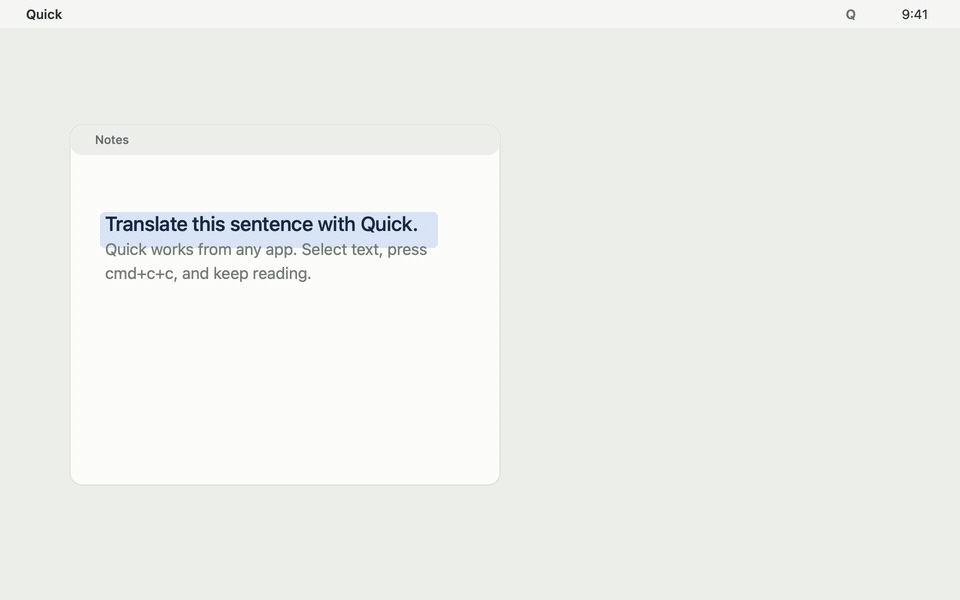

# Quick

Native macOS `cmd+c+c` translation with local OCR.

[](https://github.com/Links17/quick/actions/workflows/ci.yml)
[](https://github.com/Links17/quick/releases/latest)
[](LICENSE)
[](https://github.com/Links17/quick/stargazers)

Quick is a lightweight macOS menu bar translator and OCR utility built around one gesture: copy text or an image anywhere, press `cmd+c+c`, and get a focused popup.

It is designed for people who like instant shortcut translation but want a small native Swift app with configurable OpenAI-compatible providers and on-device image OCR.



## Download

Download the latest DMG from [GitHub Releases](https://github.com/Links17/quick/releases/latest).

Project site: [links17.github.io/quick](https://links17.github.io/quick/)

## Highlights

- Native Swift macOS menu bar app.
- Default shortcut: `cmd+c+c`.
- No keyboard monitoring permission needed for the default shortcut.
- Text input goes through OpenAI-compatible translation.
- Image input goes through local PP-OCRv6 tiny OCR via ONNX Runtime.
- Editable source text on the left, translated text on the right.
- Press Return in the source pane to translate again.
- Click outside the popup to dismiss it.
- Configurable OpenAI-compatible Base URL.
- Configurable System Prompt sent as the Responses API `instructions` field.
- API key stored in macOS Keychain.

## How It Works

Quick watches pasteboard changes instead of global keyboard events for the default shortcut.

1. Select text or copy an image in any app.
2. Hold `cmd` and press `c` twice quickly.
3. Quick sees two supported pasteboard changes while `cmd` is down.
4. If the pasteboard contains text, Quick sends it to the configured OpenAI-compatible endpoint.
5. If the pasteboard contains image data, Quick runs local OCR with bundled PP-OCRv6 tiny ONNX models.
6. The popup shows the translation or OCR result.

This avoids the fragile macOS Input Monitoring path for the default gesture. Input Monitoring and Accessibility are only needed if you enable a custom shortcut that simulates copy.

Image OCR runs locally. Image contents are not sent to the configured OpenAI-compatible provider.

## Settings

Open the menu bar item `Quick -> Settings...`.

| Setting | Purpose |
| --- | --- |
| API Key | OpenAI or OpenAI-compatible provider key. Stored in Keychain. |
| Base URL | Provider root or endpoint, such as `https://api.openai.com`, `https://example.com/v1`, or `https://example.com/v1/responses`. |
| Model | Any model name supported by your provider. |
| System Prompt | Sent as the Responses API `instructions` field. |
| Double-copy interval | Time window for detecting `cmd+c+c`. |
| Custom shortcut | Optional single shortcut that copies and translates. |

Default System Prompt:

```text
You are a translation assistant. If I input English, translate it into Chinese; if I input Chinese, translate it into English.
```

## Build

Requirements:

- macOS 13 or newer
- Xcode with Swift 6 support

Build and test:

```bash
swift build
swift test
```

Package a local `.app` bundle:

```bash
make app
open dist/Quick.app
```

Create a release zip:

```bash
make zip
```

Create a DMG:

```bash
make dmg
```

Install locally:

```bash
make install
```

The GitHub release workflow builds and uploads `Quick.app.zip` and `Quick.dmg` whenever a `v*` tag is pushed.

## Development Notes

- `QuickCore` contains testable logic: copy gesture detection, clipboard routing, OCR text layout, settings, Keychain access, OpenAI request building, and response parsing.
- `QuickOCR` contains local PP-OCRv6 tiny ONNX Runtime integration.
- `Quick` contains AppKit/SwiftUI integration: menu bar item, settings window, pasteboard monitor, popup UI.
- The local packaged app is unsigned. macOS Keychain and privacy permissions may ask again after rebuilds because the binary identity changes.

OCR implementation notes live in [docs/ocr.md](docs/ocr.md).

## Project Structure

```text
Sources/QuickCore/      Core logic and tests
Sources/QuickOCR/       Local ONNX OCR integration
Sources/Quick/          macOS app UI and system integration
Tests/QuickCoreTests/   Unit tests
AppBundle/              Minimal app bundle metadata
docs/                   Product requirements and implementation notes
documentation/          Reviewer-oriented system documentation
```

## Verification

Current verification command:

```bash
swift test
```

## License

MIT
